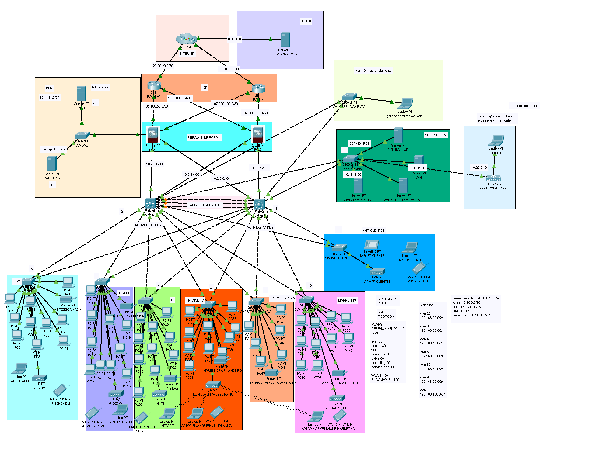
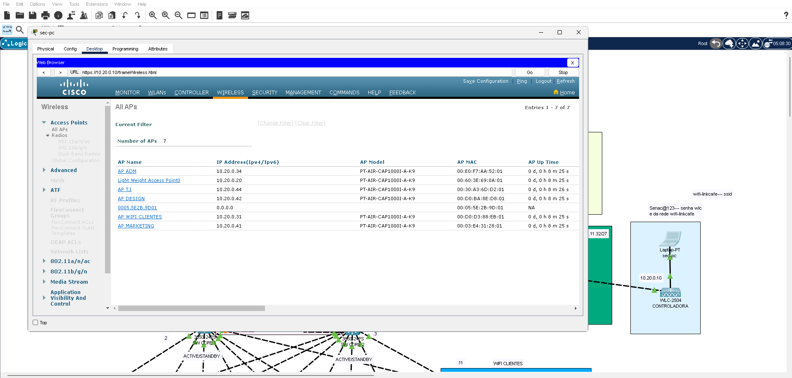
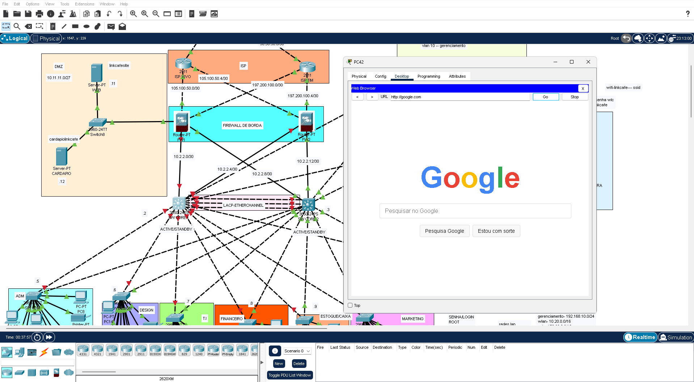
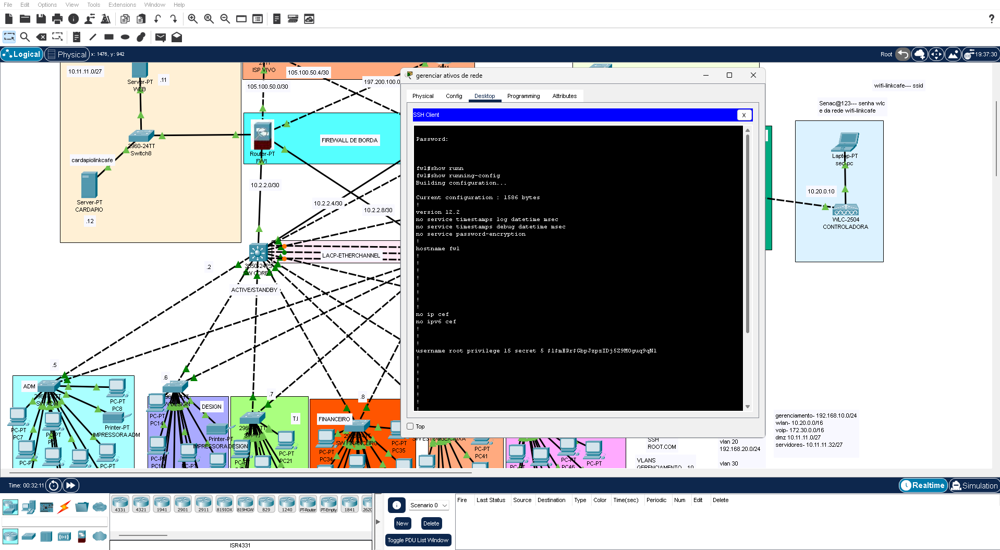
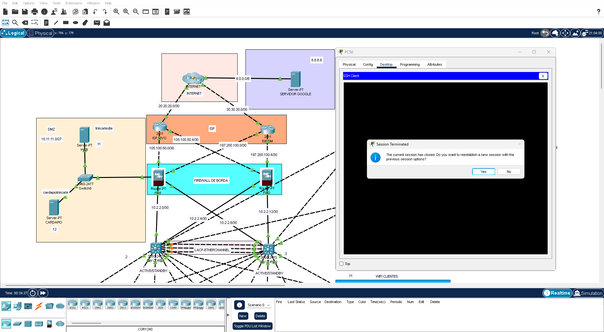
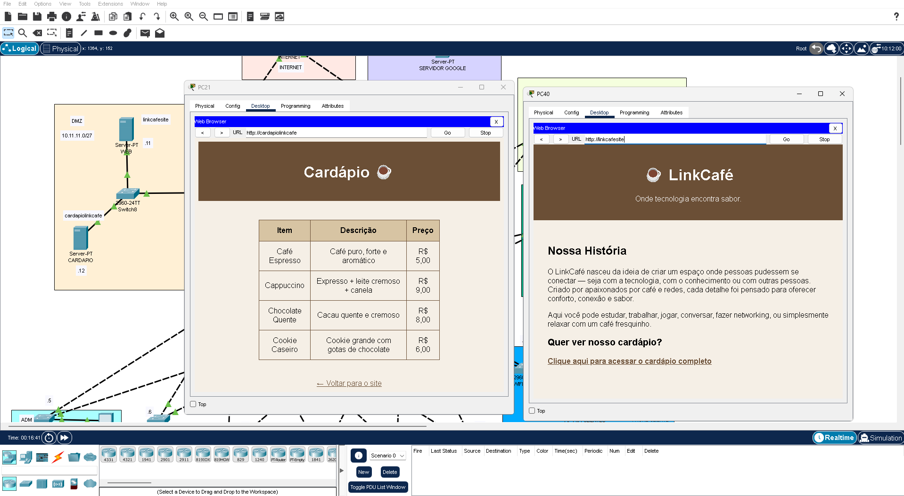
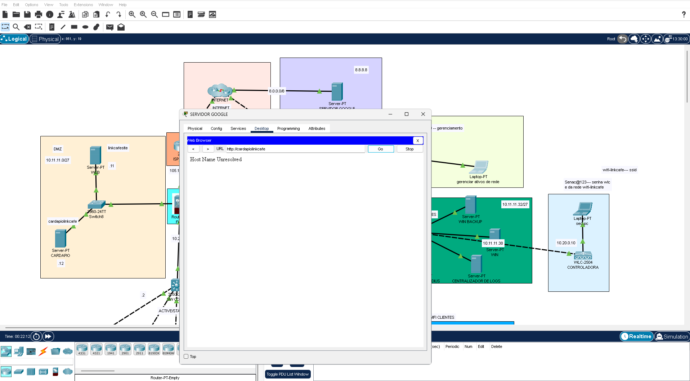
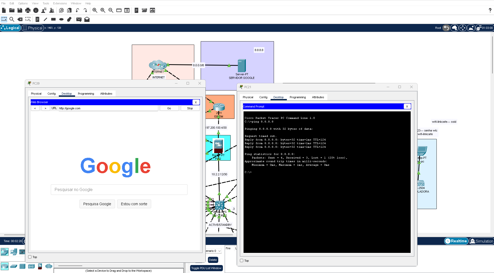

# Enterprise Network Infrastructure Lab

Enterprise-grade network infrastructure developed in Cisco Packet Tracer focused on security, segmentation, redundancy, wireless management and centralized administration.

---

# Topology



---

# Project Overview

This project simulates a real-world enterprise network environment using Cisco technologies and security best practices.

The infrastructure was designed using a hierarchical architecture model with:

- Core Layer
- Distribution Layer
- Access Layer
- Wireless Infrastructure
- Dedicated Management Network
- Server Segment
- DMZ Zone
- Border Firewalls
- ISP Connectivity
- Redundant Routing

---

# Infrastructure Features

## Network Segmentation

- Department-based VLAN segmentation
- Dedicated management VLAN
- Wireless client isolation
- Server VLAN separation
- Voice VLAN support

---

## Redundancy & High Availability

- Dual core switches
- HSRP default gateway redundancy
- EtherChannel aggregation
- Redundant firewall architecture
- OSPF dynamic routing

---

## Security Features

- SSH-only remote administration
- ACL-based management access
- Port Security
- BPDU Guard
- DHCP Snooping
- Dynamic ARP Inspection (DAI)
- Dedicated management subnet
- Disabled unused interfaces
- VLAN isolation
- Vlan Black Hole

---

## Wireless Infrastructure

- Wireless LAN Controller (WLC)
- Enterprise wireless segmentation
- Wireless client VLAN
- Centralized wireless administration


---

# Wireless LAN Controller Management

The wireless infrastructure is centrally managed through a Wireless LAN Controller (WLC), allowing centralized configuration and monitoring of enterprise wireless services.

The management workstation (`sec-pc`) is used to securely access the WLC web interface and administer wireless configurations across the infrastructure.

## Wireless Features

- Centralized WLAN management
- Enterprise SSID deployment
- VLAN-based wireless segmentation
- Wireless client isolation
- Access Point management
- Centralized wireless administration

## WLAN Administration

The WLC interface allows administrators to:

- Create and manage WLANs
- Associate VLANs to wireless networks
- Monitor connected wireless clients
- Configure Access Points
- Apply wireless security policies

## WLC Management Access

The following screenshot demonstrates the secure administrative access from the management workstation (`sec-pc`) to the Wireless LAN Controller interface.



---

## Routing & Switching

- Inter-VLAN Routing
- OSPF Area 0
- Layer 3 core switching
- Trunking
- EtherChannel (LACP)
- HSRP gateway redundancy

---

# Network Architecture

## Core Layer

| Device | Function |
|---|---|
| sw-core1 | Primary Layer 3 Core |
| sw-core2 | Secondary Layer 3 Core |

The core layer is responsible for:

- Inter-VLAN routing
- Dynamic routing (OSPF)
- Gateway redundancy (HSRP)
- Distribution switching
- High availability

---

## Firewall Layer

| Device | Function |
|---|---|
| fw1 | Primary Border Firewall |
| fw2 | Secondary Border Firewall |

Firewall responsibilities:

- Border protection
- Access control
- ICMP filtering
- SSH management restriction
- WAN connectivity

---

## Access Layer

| Switch | Department |
|---|---|
| SW-ADM | Administration |
| sw-design | Design |
| sw-ti | IT |
| sw-financeiro | Finance |
| sw-marketing | Marketing |
| sw-caixa | POS/Cashier |
| sw-servidores | Servers |
| sw-gerenciamento | Management |
| sw-dmz | DMZ |

---

# VLAN Structure

| VLAN | Purpose | Subnet |
|---|---|---|
| 10 | Management | 192.168.10.0/24 |
| 20 | Administration | 192.168.20.0/24 |
| 30 | Design | 192.168.30.0/24 |
| 40 | IT | 192.168.40.0/24 |
| 50 | Wireless | 10.20.0.0/16 |
| 60 | Finance | 192.168.60.0/24 |
| 70 | Voice | Voice VLAN |
| 80 | POS/Cashier | 192.168.80.0/24 |
| 90 | Marketing | 192.168.90.0/24 |
| 100 | Servers | 10.11.11.32/27 |
| 199 | Disabled/Unused Ports | Isolated |

---

# Dynamic Routing

The infrastructure uses OSPF for internal routing.

## OSPF Features

- Area 0 backbone
- Dynamic route propagation
- Redundant path support
- Core-to-firewall routing

---

# High Availability

## HSRP

Implemented across all VLAN gateways:

- Virtual gateway redundancy
- Automatic failover
- Improved availability

  ---

## Failover Validation

The infrastructure was tested against simulated core failures to validate high availability and redundancy mechanisms.

During failover testing, one of the core devices was intentionally disabled to simulate a network outage scenario. Network services and external connectivity remained operational through the redundant infrastructure path.

The following screenshot demonstrates successful Internet connectivity during a simulated core failure event.



---

## EtherChannel

LACP EtherChannel configured between core devices for:

- Link aggregation
- Increased bandwidth
- Redundancy

---

# Security Hardening

## Switch Security

- Sticky MAC
- Port-security
- Violation restriction
- BPDU Guard
- PortFast
- Disabled unused interfaces
- Black Hole Vlan

---

## Layer 2 Protection

- DHCP Snooping
- Dynamic ARP Inspection
- Trusted trunk interfaces

---

## Administrative Security

- SSH Version 2
- ACL-restricted management
- Local authentication
- Management VLAN isolation


# Secure Administrative Access Control

Administrative access to infrastructure devices is restricted exclusively to hosts located within the dedicated Management VLAN.

Access Control Lists (ACLs) were implemented to prevent unauthorized hosts from accessing network devices through SSH (TCP/22).

## Security Policy

- SSH-only remote administration
- Port 22 restricted to Management VLAN
- Unauthorized hosts blocked
- Dedicated management subnet
- Centralized infrastructure administration

---

## Authorized Administrative Access

Hosts located inside the Management VLAN are authorized to establish SSH sessions with enterprise infrastructure devices for secure administration and configuration.

The following screenshot demonstrates successful SSH administrative access from an authorized host within the Management VLAN.



---

## Unauthorized Administrative Access Blocked

Hosts outside the Management VLAN are restricted from accessing infrastructure devices through TCP port 22.

Firewall and ACL policies prevent unauthorized SSH administrative connections originating from non-management networks.

The following screenshot demonstrates blocked SSH access attempts from unauthorized hosts outside the Management VLAN.



---

# Enterprise Services

The infrastructure includes:

- DHCP relay
- RADIUS-ready environment
- Wireless management
- Centralized administration
- DMZ segmentation
- Internal server infrastructure

---

# Technologies Used

## Networking & Infrastructure

- Cisco Packet Tracer
- Cisco Layer 2 Switching
- Cisco Layer 3 Switching
- Enterprise Network Architecture
- Hierarchical Network Design
- WAN Connectivity
- DMZ Architecture
- Redundant Core Infrastructure

---

## Routing & High Availability

- OSPF Dynamic Routing
- Inter-VLAN Routing
- HSRP Gateway Redundancy
- Static Routing
- Redundant WAN Routing
- Failover Testing

---

## Switching Technologies

- VLAN Segmentation
- Trunking (802.1Q)
- EtherChannel (LACP)
- Rapid PVST+
- PortFast
- BPDU Guard
- Port Security
- Sticky MAC Addressing

---

## Network Security

- Access Control Lists (ACLs)
- SSH Version 2
- Administrative Access Restriction
- Dedicated Management VLAN
- DHCP Snooping
- Dynamic ARP Inspection (DAI)
- Unused Port Shutdown
- Layer 2 Hardening
- DMZ Isolation
- Firewall Filtering Policies

---

## Wireless Infrastructure

- Wireless LAN Controller (WLC)
- Enterprise WLAN Management
- Wireless VLAN Segmentation
- Centralized Wireless Administration
- Access Point Management

---

## Services & Administration

- Secure Device Management
- SSH Remote Administration
- Centralized Infrastructure Management
- Network Monitoring Concepts
- Enterprise Device Hardening

---

# Repository Structure

```txt
Enterprise-Network-Lab/
│
├── README.md
├── packet-tracer/
│   └── enterprise-network-lab.pkt
│
├── docs/
│   ├── .pngs
│   └── architecture-notes.md.txt
│
├── configs/
│   ├── core/
│   ├── access/
│   ├── firewall/
│   ├── routing/
│   └── wireless/
│
└── verification/
    ├── show-ip-route.txt
    ├── show-vlan.txt
    ├── show-etherchannel.txt
    └── show-standby.txt
```

---

# Screenshots

## Core Infrastructure

Add screenshots showing:

- Core switches
- HSRP
- EtherChannel
- OSPF neighbors
- VLAN routing

---

## Security Features

Add screenshots showing:

- Port-security
- DHCP Snooping
- ARP Inspection
- SSH access restriction

---
---

# DMZ Protection Policy

The DMZ environment is isolated from unauthorized external access through firewall filtering and segmentation policies.

External public hosts are restricted from directly accessing protected internal services located in the DMZ segment.

## Security Controls

- Border firewall filtering
- DMZ segmentation
- Controlled inbound access
- Internal resource isolation
- Restricted Internet-originated communication

## Security Validation

- External hosts cannot directly access DMZ resources
- Internet-originated ICMP blocked toward protected segments
- Internal services remain isolated from public networks


---

# DMZ Access Control Validation

The infrastructure implements controlled access policies between internal users, external networks and the DMZ environment.

Internal corporate users are allowed to access authorized services hosted in the DMZ segment, while external public networks are restricted by firewall security policies.

## Internal Access to DMZ Services

Authorized internal users can successfully access web services hosted in the DMZ environment through controlled internal routing and firewall policies.

The following screenshot demonstrates successful internal access to the DMZ web server.



---

## External Access Restriction

External public hosts connected through the Internet segment are restricted from directly accessing protected DMZ services.

Firewall filtering policies prevent unauthorized Internet-originated communication toward internal protected resources.

The following screenshot demonstrates blocked external access attempts to the DMZ web server.




---

# External Connectivity Validation

The infrastructure successfully provides controlled external connectivity to public services on the Internet.

Internal hosts are capable of reaching external networks through the enterprise edge infrastructure and WAN routing configuration.

## Connectivity Validation

- Successful ICMP communication to external public servers
- Internet reachability through redundant ISP architecture
- Internal-to-external traffic routing operational
- WAN routing functioning correctly

### Google Connectivity Test

The following test demonstrates successful communication between an internal workstation and an external public server.




# Usage

Open the `.pkt` file using:

- Cisco Packet Tracer 8.x+

---

# Objectives

This project was developed to improve skills in:

- Enterprise networking
- Cisco infrastructure
- Layer 2 security
- Layer 3 routing
- High availability
- Wireless networking
- Infrastructure hardening
- Network segmentation

---

# Author

- Developed by viieiramatheuss.
